# Mystery Box Marketplace

**<h2>Github</h2>**
https://github.com/allenbad/rails_solo

---

**<h2>Website</h2>**
https://frozen-coast-31175.herokuapp.com/

---

**<h2>Table of Contents<h2>**

**<h3>Section 1 About </h3>**

- Section 1.1 About Mystery Box Marketplace

**<h3>Section 2 Design Documentation</h3>**

- Section 2.1 Design Process

- Section 2.2 User Stories

- Section 2.3 Workflow

- Section 2.4 Wireframes

- Section 2.5 Database Entity Relationship Diagram

**<h3>Section 3 Planning Process</h3>**

- 3.1 Screenshots of Trello Board

**<h3>Section 4 Answer Questions</h3>**

- 4.1 Answer Questions

---

---

**<h2>Section 1 About Mystery Box Marketplace<h2>**

<h3>Mystery box marketplace is an online shopping platform. Its design goal is to provide a platform, which is divided into sellers and buyers. By logging into the platform, people are allowed to sell things they don't need, while they are allowed to buy things you think are interesting.
You can't tell what the item is by looking at the picture, you can only get the information by a short description, and when you receive the item, you will be surprised or shocked completely randomly. This is the most interesting part.
There are still a lot of imperfections and ideas that need to be added, such as the ability to score products.</h3>

---

**The tech stack we used to create this app include :**

- Ruby on rails for a web app framework.

- Github for version and source control.

- Slack & Discord for people communication.

- Trello for task management.

- Heroku for the use of a deployment platform.

- VSCode for code edit.

- HTML, CSS, Javascript, SQL and Ruby for programming languages.

- Bootstrap for webpage layout.

- PostgreSQL for database.

- AWS For Image Uploading.

- Stripe for accepting payments online.

- Google Geocoding API for the show of location.

---

Gems installed

gem "faker", "~> 2.11"

gem "aws-sdk-s3", "~> 1.64"

gem "devise", "~> 4.7"

gem "cancancan", "~> 3.1"

gem "stripe", "~> 5.22"

gem "geocoder", "~> 1.6"

gem 'rails_admin', '~> 2.0'

gem "jquery-rails", "~> 4.4"

gem "rubocop-rails"

---

**Setting up (step by step)**

- Git clone the files from the repo

- Move into the directory and run on command line:
  - yarn install
  - bundle install
  - rails db:create
  - rails db:migrate
  - rails db:seed
  - rails s 
  To ensure the setup ran properly, go to your local host and type in http://127.0.0.1:3000
  If Mystery box market renders onto the page, you are now up and ready to begin!(default user: test1@box.com , password: password )

---

---

**<h2>Section 2 Design Documentation</h2>**

**Section 2.1 Design Process**

- Section 2.1 Design Process

    - The design process i use the Agile methodology, design the project framework well, add the required functions and respond quickly as the requirements are updated to add the required functions.

* Section 2.2 User Stories

  - Please refer to Section 4, Q6

* Section 2.5 Database Entity Relationship Diagram

  - Please refer to Section 4, question 14.

---

---

**<h2>Section 3 Planning Process</h2>**

**Section 3.1 Screenshots of Trello Board(s)**

These screenshots depict the certain stages off my development process by keeping track of objectives through Trello. It was a good way to keep track of what needed to be done side by side.

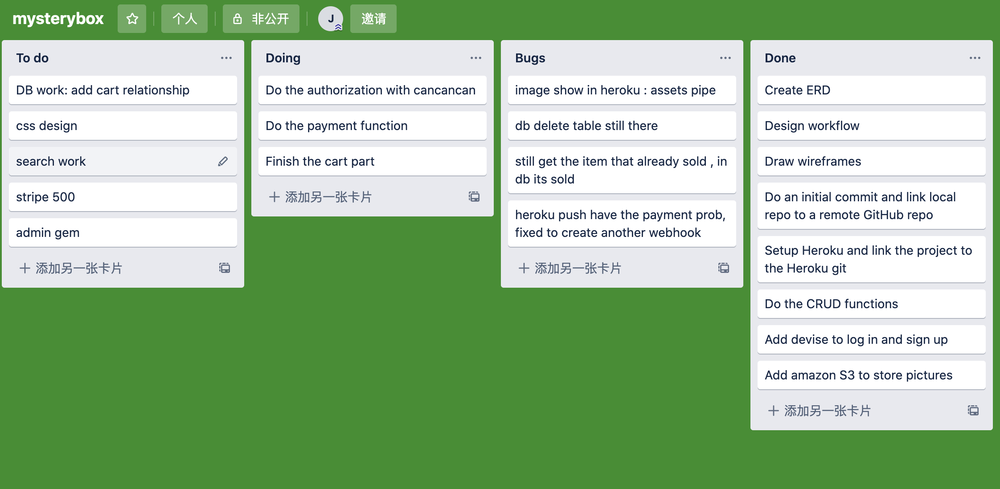
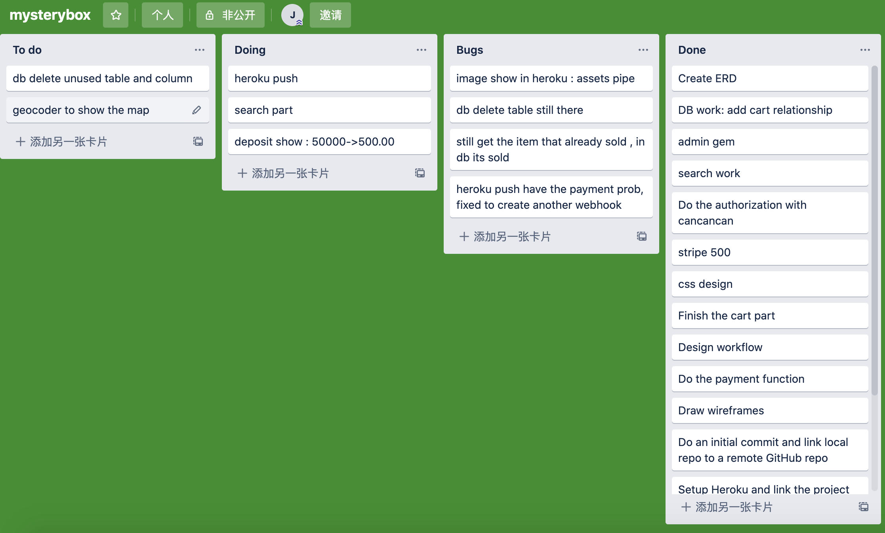
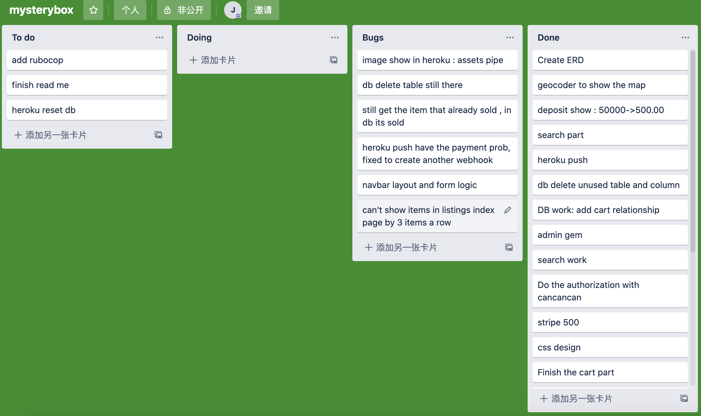

Every day, I make a list of the problems that need to be solved, and then I put them into the list. Put the problems in the test on the bug list. I also use Google doc to document bugs and solutions.

---

**<h2>Section 4.1 Answer Questions<h2>**

---

<h4>1. Identification of the problem you are trying to solve by building this particular marketplace app.</4>
The service mode of the mysterious box trading platform on the market is too complicated, people must abide by the existing product classification and rules to trade by category. The creation of this platform allows people to choose the commodities they may like at will, which is more free and open and more mysterious, because the commodity information you know is very limited.

---

<h4>2. Why is it a problem that needs solving? </h4>
 Rather than having to go through a general shopping platform, I decided to bring all the buyers and sellers under one roof conducting transactions between each other.Let the two sides of the transaction more freely, the transaction process is simpler.

---

<h4>3. A link (URL) to your deployed app (i.e. website) </h4>
<h4>4. A link to your GitHub repository (repo).</h4>

To answer these questions, Please refer to the beginning of README.

---

<h4>5. Description of your marketplace app (website), including:

  - Purpose
  - Functionality / features
  - Sitemap
  - Screenshots
  - Target audience
  - Tech stack (e.g. html, css, deployment platform, etc)
</h4>
1.Purpose

Create an easy-to-use trading platform that allows buyers and sellers to trade under the same roof, free from the constraints and cumbersome operations of existing trading platforms.

2.Functionality / features

As a seller, you can create products, modify product information, delete products, and modify personal information. As a buyer, you can buy the goods you like. The administrator has the highest authority to delete and modify merchandise and user information.

3.Sitemap

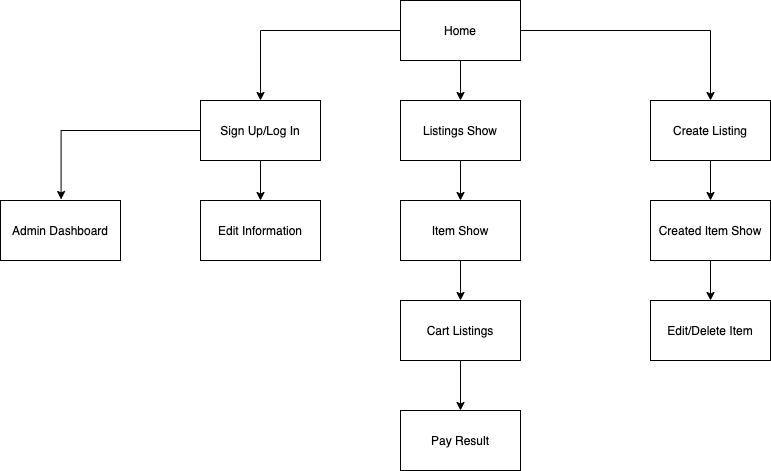

4.Target audience

The target audience is people who don't have gift ideas, or who just like the unknown, like surprises, and like simple operations. The app i have conducted links buyers and sellers under one roof for one common task/goal.

5.Tech stack 

Please refer to Section 4

---

<h4>6.User stories for your app</h4>

I'll show you some example:

- As Tom, I want to be be able to give someone a unique gift because I am utterly clueless at gifting ideas.

* As Joshua, I want to be able to sell items lying around my house to clean up clutter and make some cash.

- As Daniel, I want to purchase a surprise item because I'm curious and have cash lying around.

* As Bob, I want to buy other peoples unwanted items in case there's something valuable to salvage or sell.

- As Hawthorne, I want to get rid of unwanted items and would like to get paid something for it.

---

<h4>7.Wireframes for your app</h4>

Home Page

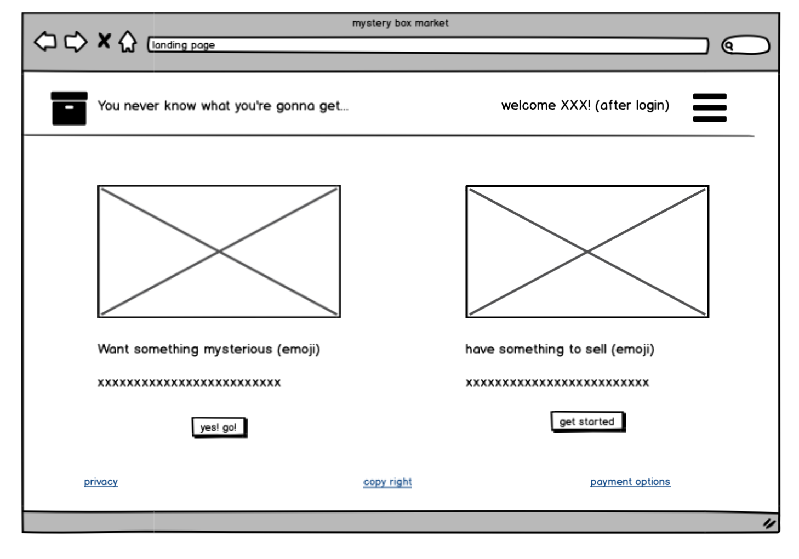

Listing Page

Navbar Design

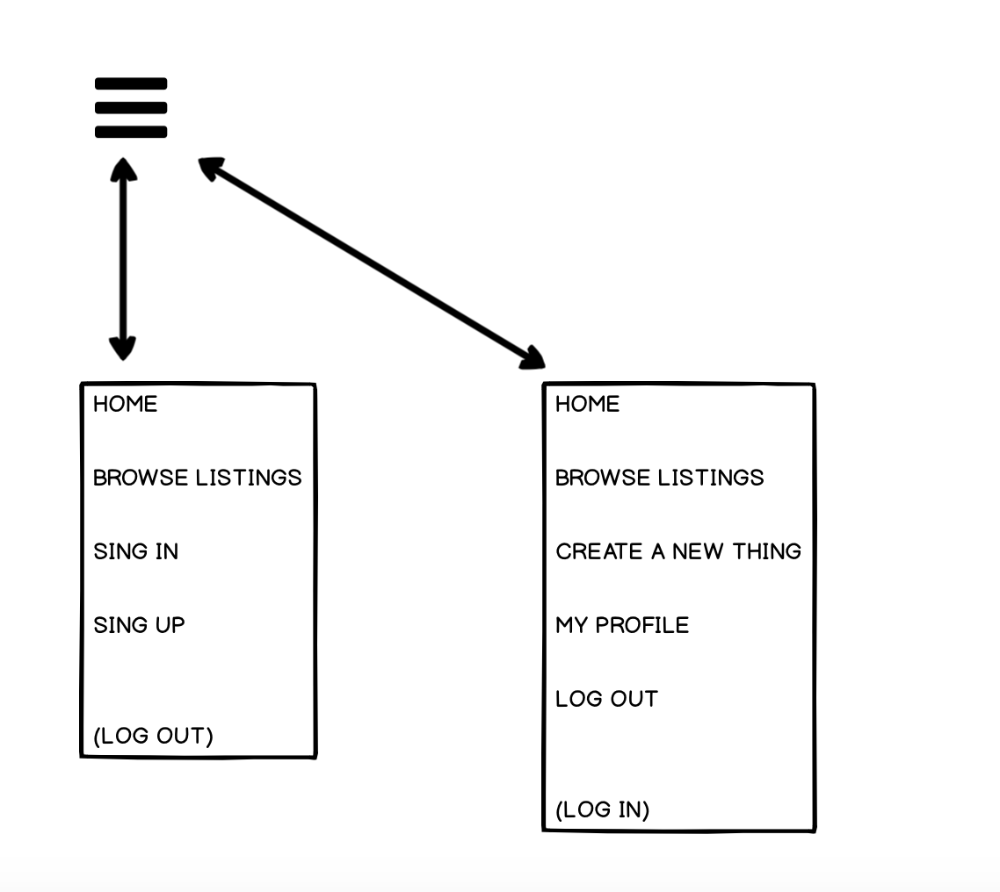

Register and Log In Page

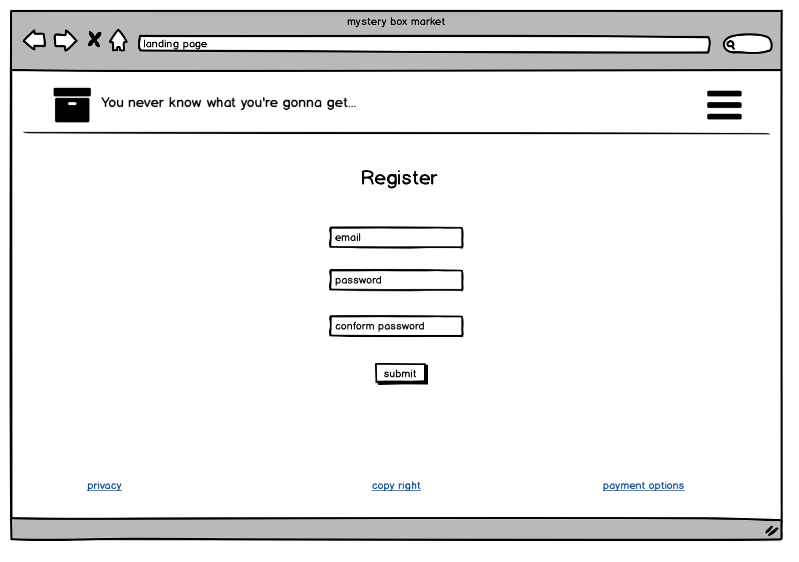

Cart Page

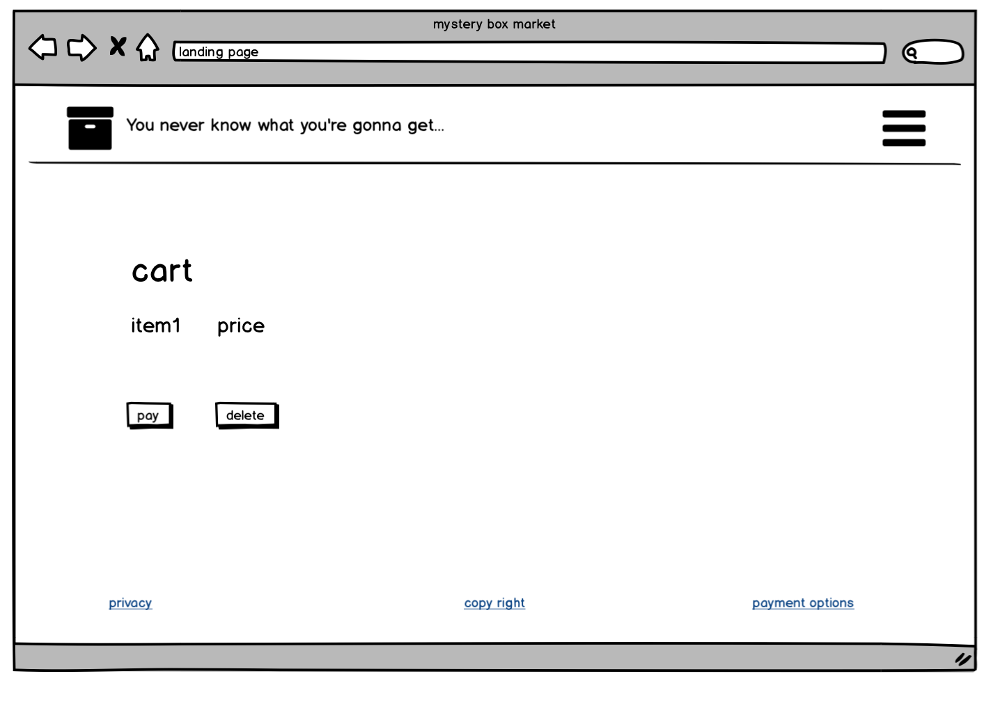

User Page

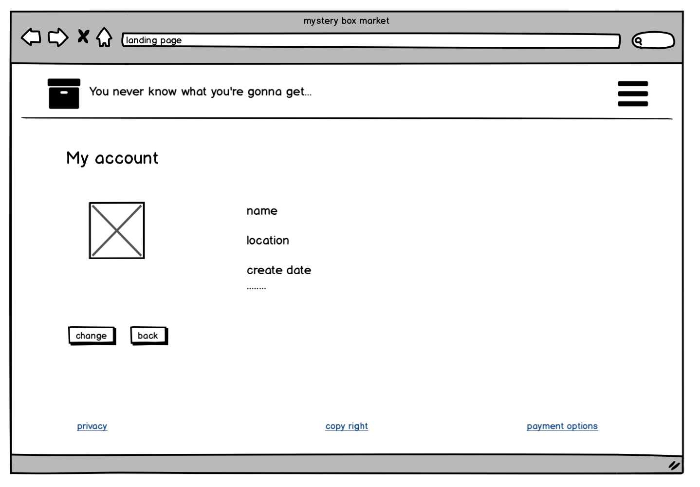

Admin Dashboard Page

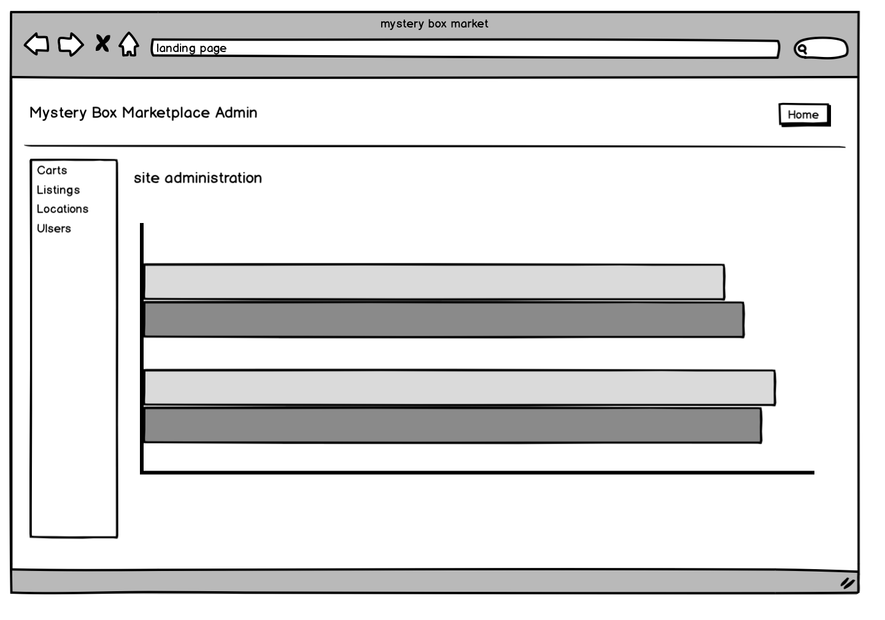

<h4>8.An ERD for your app</h4>

Database Schema Design

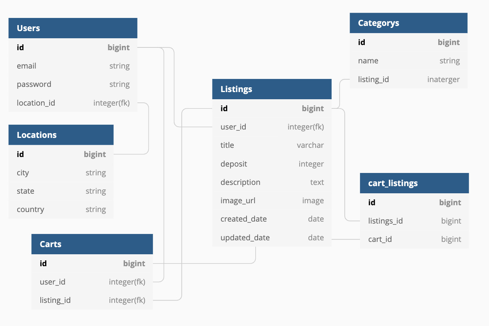

<h4>9.Explain the different high-level components (abstractions) in your app</h4>

One example of a higher level component in  my app is active record. active record is a module with the base class inside of it that gives our models methods that allow us to manipulate data.

essentially, active record can be called on our models to create, read, update and delete records. in the background its executing SQL that does this record manipulation.

Active storage allows you to upload files to cloud storage services such as Amazon S3 and attach these files to the active record object. You can easily store data remotely without taking up your local storage space.

Action view , anything relating to being viewed on the screen was located in the views component. There was very little logic inside our views and if there were, it would be simple if statements. For example, if someone is logged in they should be able to see this information/button else it would either render nothing or a message telling the user to sign in to be able to do this feature.

For example, erb, we can use the <% %> tag to execute Ruby code without returning a value, such as conditional judgment, loop, or code block. <%= %> is used to output the result.

<h4>10.Detail any third party services that your app will use</h4>

1. AWS

   A way for Users to upload images to the site that are saved to a third party cloud in order to not have files saved onto my local machine.

2. Stripe

   A way for Users to buy and sell online using their credit cards in a safe environment.

3. Geocoder

   An API for let me call the Google map by entering coordinates to show my location.

4. Heroku

   A way for My application to be deployed online to the world wide web.

  Instead and use:

  -brew install heroku/brew/heroku

  -cd dirctory

  -$ heroku login

  -$ heroku create

  -$ git add .

  -$ git commit -m”xxxx”

  -$ git push heroku master

  go back to heroku webpage -> your project->settings->reveal config vars
  key->add key(RAILS_MASTER_KEY) value(rails->master.key)

  -$ heroku open

  How to reset PG Database on Heroku:

  Step 1: heroku restart

  Step 2: heroku pg:reset DATABASE (no need to change the DATABASE)

  Step 3: heroku run rake db:migrate

  Step 4: heroku run rake db:seed (if you have seed)

<h4>11.Describe your projects models in terms of the relationships (active record associations) they have with each other</h4>

Models communicate to each other through associations. Depending which model it is will determine its association to other tables such as having:

Belongs_to

Has_many

Has_many through another

That way each table can interact with each other whilst still being a separate entity. For example, a listing belongs_to a user where as a user has_many listings. A product order belongs to a user and listing while a listing has_one product order and a user has_many product orders.

<h4>12.Discuss the database relations to be implemented in your application</h4>

The database relations to be implemented is to have primary and foreign keys. All the models are based around the user model. This way, i create the relations between different databases so they can communicate with each other whilst still being a separate entity.

<h4>13.Provide your database schema design</h4>

To do the db work in command line(some example):

create : rails g model Tablename name:string description:text price:decimal seller_id:integer email:string img_url:string

drop: rails g migration DropName

add reference : rails g AddNameRefToTablename

<h4>14.Describe the way tasks are allocated and tracked in your project</h4>

Please refer to Section 3.1
